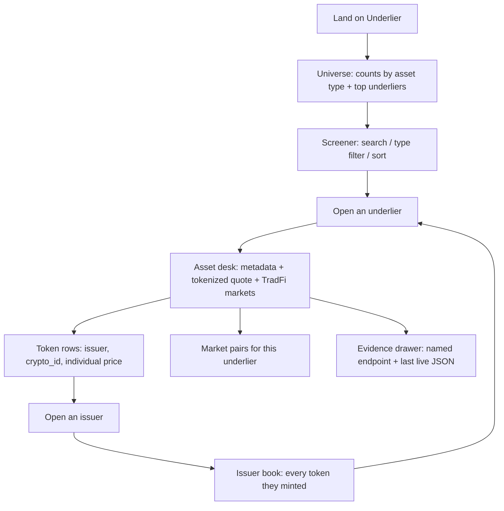

# Underlier — Day 1 lock

Build with CMC: API Hackathon. Track and product are locked here. Nothing has been built yet.

## Track

**Real World Assets**

Submitted against `/real-world-assets/*`. We will still call a crypto quotes fallback when we need a live token price.

### Why this track

Judging is 100 points: works (30), useful to a real person (25), interesting API use (20), code and docs (15), presentation (10).

| Track | Why not (or why yes) |
|---|---|
| Markets and Trading Tools | Will be crowded with listings screeners on `/cryptocurrency/*`. Hard to look interesting. |
| AI Agents and Automation | MCP wrappers are easy to ship and hard to *use*. Judges cannot sit inside your agent. |
| Data and Visualisation | Generic dashboards of BTC dominance do not need the new API. |
| **Real World Assets** | CMC created a dedicated **New** track, shipped 7 endpoints, and wrote academy tutorials for them. Almost nobody has a working product on this surface yet. |

RWA also maps cleanly onto the score:

- **Interesting use (20).** The new family is the point of the track. We stitch `rwa_id` → metadata → issuers → tokens (`crypto_id`) → aggregate quotes → market pairs. That join is the API, not a single quotes call.
- **Useful to a real person (25).** Tokenized NVDA / gold / T-bills look like regular coins. The question a person actually has is: *who issued this, on which markets, and what is the real asset behind it?*
- **Does it work (30).** Seven endpoints are documented and on Basic/Startup. If the newer market-data calls fail, the SpaceX guide already documents the fallback: issuer token → `/v2/cryptocurrency/quotes/latest`.
- **Chain-neutral.** Issuers span many chains. We do not pick one.

CMC also asked for a short note on where the API got in the way. Building on a one-month-old surface makes that note real.

---

## Idea (locked)

**Underlier** — a research desk for tokenized real-world assets.

CMC already has two public views that do not meet in the middle:

1. [coinmarketcap.com/real-world-assets](https://coinmarketcap.com/real-world-assets/) — ranked *underliers* (Gold, NVDA, treasuries).
2. [coinmarketcap.com/view/tokenized-assets](https://coinmarketcap.com/view/tokenized-assets/) — ranked *tokens* (PAXG, TSLAX, Ondo wrappers).

Underlier is the join: one underlier, every issuer that tokenized it, every market those tokens trade on, plus the company / instrument metadata that tells you what you actually own.

One-line pitch: *See the real asset behind every tokenized stock, treasury, and commodity.*

---

## Problem and who it is for

**Who.** A person about to buy a tokenized stock, gold, or treasury on-chain — or a researcher writing about that market. They already use CMC. They do not want another generic coin screener.

**Problem.** Tickers collide. `NVDA` is a Nasdaq equity *and* several issuer tokens. `SPCX` is a listing *and* a Backpack token. CMC's own docs say: resolve `rwa_id`, never trust the ticker alone. Today you bounce between an RWA page, a coin page, an issuer site, and Yahoo Finance to answer one question:

> If I want this underlier on-chain, who issued it, where does it trade, and what is the tokenized price versus the TradFi market?

**What success looks like for that person.** Search `NVDA` or `GOLD` or `SPCX`. Land on one desk. See asset type, company fields, tokenized aggregate quote, each issuer token, and the markets. Leave knowing whether they are looking at the underlier or at someone else's wrapper.

---

## User flow

Primary path a judge should take in under two minutes:

1. Open the app.
2. Filter to **stock** or search `NVDA`.
3. Open the asset desk.
4. See at least one issuer token and one market pair from a live CMC call.
5. Open the issuer, then the evidence drawer.

---

## Key screens

### 1. Universe + screener — `/`

- Header: product name, search, last successful CMC call timestamp.
- Type chips: All, Stocks, Commodities, Treasuries, ETFs, FX, Real estate. Counts from `/v5/real-world-assets/map`.
- Table: rank, name, symbol, type, tokenized price, tokenized market cap, 24h tokenized volume, “has tokens” flag. Data from `/v5/real-world-assets/assets/list`.
- Empty: no matches for this filter.
- Loading: skeleton rows.
- Error: CMC status message + retry. If the key is missing, a clear local-setup state, not a blank page.

### 2. Asset desk — `/asset/[rwa_id]`

- Identity: logo, name, symbol, `rwa_id`, `rwa_rank`, asset type.
- About: description, website, equity fields when present (exchange, industry, employees, founded, CIK). From `/v5/real-world-assets/info`.
- Quote strip: average tokenized price, tokenized market cap, 24h volume. From `/v5/real-world-assets/quotes/latest`.
- TradFi markets block from the same quotes payload (when CMC returns them).
- Tokens table: issuer, token name, symbol, `crypto_id`, individual price.
- Markets table: pairs from `/v5/real-world-assets/market-pairs/list`.
- Evidence drawer on this page.

### 3. Issuers directory — `/issuers`

- Paginated list from `/v5/real-world-assets/issuers/list` (name, token count, active).

### 4. Issuer book — `/issuer/[issuer_id]`

- Issuer identity + full token list from `/v5/real-world-assets/issuers`.
- Each row links back to the underlier via `rwa_id`.

### 5. Cross-cutting states

- No API key: setup instructions, never a crash.
- Rate limit / 429: say so, show cached last-good payload if we have one.
- Asset with no tokens: still show metadata; do not pretend there is a market.

Mobile: chips wrap, tables become stacked cards, desk sections stack. Desktop: full table + two-column desk.

---

## Tech stack

| Layer | Choice | Why |
|---|---|---|
| App | Next.js (App Router) + TypeScript | Official scaffold, serverless routes, easy deploy. |
| UI | Tailwind + shadcn/ui | Default for this kind of web surface. |
| CMC access | Next.js Route Handlers as a BFF | Key stays on the server. Never shipped to the client. Never committed. |
| Data | Live CMC only when `CMC_API_KEY` is set | Fixture JSON in-repo for local UI work; production/demo uses real calls. |
| Hosting | Vercel-compatible | Matches a working demo link. |

No database. No auth. No second component library.

Fallback if `/assets/list`, `/quotes/latest`, or `/market-pairs/list` error: resolve via `/map` + `/info` + `/issuers` + `/v2/cryptocurrency/quotes/latest` on each `crypto_id`, as in CMC’s SpaceX guide. The UI should say which path it used.

---

## Endpoints we intend to name in the submission

Must call, and name explicitly:

1. `GET /v5/real-world-assets/map`
2. `GET /v5/real-world-assets/info`
3. `GET /v5/real-world-assets/assets/list`
4. `GET /v5/real-world-assets/quotes/latest`
5. `GET /v5/real-world-assets/market-pairs/list`
6. `GET /v5/real-world-assets/issuers/list`
7. `GET /v5/real-world-assets/issuers`

Fallback / bridge:

8. `GET /v2/cryptocurrency/quotes/latest` — only when we have a `crypto_id` and the RWA quote family is missing or incomplete.

Evidence of a real call lives in two places: the in-app evidence drawer (endpoint + `status` + truncated `data`) and a checked-in sample response in the repo with secrets stripped.

---

## Must-have vs nice-to-have

### Must-have (this is the product)

- Live CMC calls for the seven RWA endpoints, with the crypto-quotes fallback documented above.
- Universe + screener with search, asset-type filter, and sort.
- Asset desk with metadata, tokenized quote, tokens, and market pairs.
- Issuer directory + issuer book, linked both ways.
- Empty, loading, error, and missing-key states.
- Desktop and mobile layouts.
- API key via env only. `.env.example` with no secret.
- README: how to run, endpoints used, sample response, “what the API made possible / where it got in the way”, track name.
- In-app evidence of the last live call.

### Nice-to-have (only after must-have works)

- Side-by-side compare of two issuer tokens on the same underlier.
- Premium / discount badge if TradFi and tokenized prices both exist.
- Local watchlist (`localStorage`).
- `convert` to a second quote currency.
- Historical charts — **out of scope**. CMC has not shipped the RWA time-series endpoint.

---

## What “done” means

The project is done when a judge who has never seen it can do all of the following without us on a call:

1. Open a public repo and run it locally with a CMC key, or open a deployed demo.
2. Search a real ticker (`NVDA`, `GOLD`, or `SPCX`) and see data that came from CMC, not lorem.
3. Open an asset desk and an issuer book.
4. Read the named endpoints in the README and see a real response (in-app drawer + repo sample).
5. Read a short, honest API feedback note.
6. Confirm the submission track is **Real World Assets**.
7. Record a 60–90s walkthrough of that path for the demo video.

Out of scope for “done”: accounts, alerts, portfolios, on-chain execution, historical RWA charts, a second track.

Submission extras (X post, DoraHacks form, `#BuildwithCMC`) are after the product is done. They are not part of this Day 1 lock.
