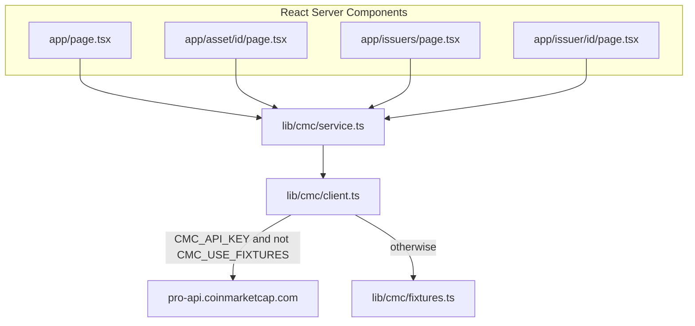

# Underlier Desk — product lock

Build with CMC: API Hackathon. Track **Real World Assets**. This is the architecture the app ships, not a backlog.

## Track

Submitted against `/v5/real-world-assets/*`, with `/v2/cryptocurrency/quotes/latest` only when an RWA token has a `crypto_id` and no tokenized price.

Judging is 100 points: works (30), useful to a real person (25), interesting API use (20), code and docs (15), presentation (10).

RWA maps onto that score because the new family is the point of the track. The product is the join: `rwa_id` → metadata → issuers → tokens (`crypto_id`) → aggregate quotes → venue identity.

## Product

**Underlier Desk** — a research desk for tokenized real-world assets.

CMC already has two public views that do not meet:

1. Ranked *underliers* (Gold, NVDA, treasuries).
2. Ranked *tokens* (PAXG, TSLAX, Ondo wrappers).

This app is the join: one underlier, every issuer that tokenized it, the markets those tokens trade on (when the plan allows), plus the company / instrument metadata that tells you what you actually own.

One-line pitch: *See the real asset behind every tokenized stock, treasury, and commodity.*

## Routes (locked)

```
/              → Market Desk (summary + screener table)
/explore       → Redirects to / with the same query string
/classes       → CMC asset-class taxonomy
/watchlist     → Browser-local saved underliers
/asset/[id]    → AssetDeskView
/issuers       → IssuerDirectory
/issuer/[id]   → IssuerBookView
```

No splash / start page. `/` is the Market Desk.

Data flow: **RSC → `lib/cmc/service.ts`**. Pages do not fetch `/api/rwa/*` from the client. Those BFF routes exist for evidence and debugging only.

Do not add auth, a database, a chart library, or a second component library. Do not invent fields or fake prices.

## Architecture



In-process memos (TTL): universe type counts from `/map`, and an issuer index for the underlier join.

## Honest API limits (do not paper over)

- `tradfi_markets` is venue identity, not a cash last. Copy: **CMC-reported venue**.
- No name-search. Ticker, slug, or `rwa_id` only.
- Two ID spaces: `rwaId` = underlier, `cryptoId` = wrapper token.
- Homepage **Tracked universe** is the map count. **Tokenized in this view** is `hasTokens` among the current table rows, not a map-wide tokenized census.
- Issuer tokens on the issuer book have **no quotes**. Do not invent market columns there.

## What “done” means

A judge who has never seen it can:

1. Run it locally with a CMC key, or open a deployed demo (fixtures if no key).
2. Search `NVDA`, `GOLD`, `SPCX`, or `TLT` and see CMC data, not lorem.
3. Open an asset desk and an issuer book.
4. Read named endpoints in the README and in **Evidence**.
5. Read a short, honest API feedback note.
6. Confirm the submission track is **Real World Assets**.
