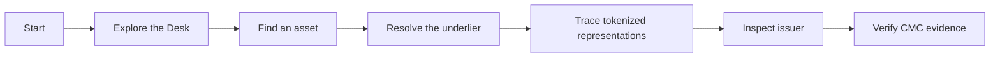
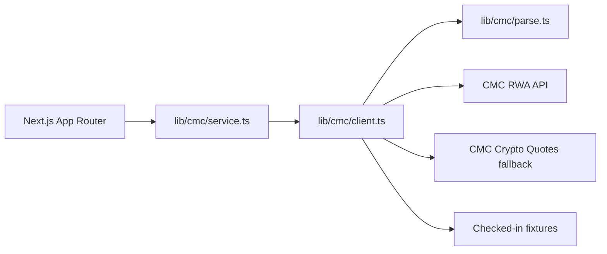

# UnderScope

**Tokenized asset investigation.**

UnderScope is a financial-intelligence investigation desk for tracing what sits behind a tokenized stock, treasury, commodity, ETF, currency, or real-estate asset.

> **Investigate what’s behind a tokenized asset.**

Built for the **Build with CMC: API Hackathon**, Real World Assets track.

## What it does

UnderScope connects four layers of an asset:

**FIND → RESOLVE → TRACE → VERIFY**

- **Find** tokenized assets across the CMC RWA universe.
- **Resolve** a ticker, slug, or `rwa_id` to the correct real-world asset.
- **Trace** tokenized representations and their issuers.
- **Verify** the underlying metadata, reported venues, quotes, and CMC evidence.

The key distinction is between an RWA's `rwa_id` and a token's `crypto_id`. The same ticker can refer to both the traditional asset and one or more tokenized representations, so UnderScope keeps those identities separate.

## Product surfaces

| Route | Purpose |
|---|---|
| `/` | First-time start page and product introduction |
| `/explore` | Market Desk with ranked tokenized assets, filters, and sorting |
| `/classes` | Asset-type taxonomy |
| `/watchlist` | Browser-local saved assets |
| `/asset/[id]` | Asset investigation desk: metadata, tokenized quotes, wrappers, issuers, and venues |
| `/issuers` | Issuer directory |
| `/issuer/[id]` | Issuer investigation book and tokenized underliers |

The normal user experience keeps technical identifiers and API details out of the main interface. **Data & Evidence** provides the deeper CMC trail for verification and judging.

## Investigation workflow



## Judge path

A judge can understand the core product quickly:

1. Open the start page and select **Explore the Desk**.
2. Browse the ranked tokenized-asset universe or filter by asset class.
3. Open an asset such as `NVDA`, `GOLD`, `SPCX`, or `TLT`.
4. Inspect the prominent asset identity, tokenized quote, issuer representations, and CMC-reported venue.
5. Follow an issuer into its investigation book.
6. Open **Data & Evidence** to inspect the CMC endpoints and response evidence behind the view.

## Run locally

```bash
npm install
cp .env.example .env.local
npm test
npm run dev
```

Add your CoinMarketCap API key to `.env.local`:

```env
CMC_API_KEY=your_key_here
```

| Requirement | Required? |
|---|---|
| `CMC_API_KEY` | Yes for live CMC data |
| Database | No |
| Authentication | No |
| AI model | No |

Without an API key, the app runs against checked-in fixture responses. To force fixture mode even when a key is present:

```env
CMC_USE_FIXTURES=1
```

Never commit API credentials. `CMC_API_KEY` is server-only and must never use the `NEXT_PUBLIC_` prefix.

## Architecture

The application uses React Server Components and keeps CoinMarketCap requests on the server.



The `/api/rwa/*` routes are backend-for-frontend endpoints used for evidence and debugging. The primary product surfaces consume the server-side service layer directly.

## CoinMarketCap endpoints

UnderScope currently integrates these CMC endpoints:

1. `GET /v5/real-world-assets/map`
2. `GET /v5/real-world-assets/info`
3. `GET /v5/real-world-assets/assets/list`
4. `GET /v5/real-world-assets/quotes/latest`
5. `GET /v5/real-world-assets/issuers/list`
6. `GET /v5/real-world-assets/issuers`
7. `GET /v2/cryptocurrency/quotes/latest` as a fallback for token quotes when an RWA token exposes a `crypto_id` but its RWA quote is unavailable

Debug/evidence routes:

- `/api/rwa/screener`
- `/api/rwa/asset/[id]`
- `/api/rwa/issuers`
- `/api/rwa/issuer/[id]`

Sample evidence is stored in:

- `evidence/sample-cmc-map-spacex.json`
- `evidence/live-nvda-quotes.json`

Sensitive values are stripped from checked-in evidence.

## API observations

The CMC RWA API shaped several product decisions:

- `rwa_id` and `crypto_id` represent different identity namespaces and must not be conflated.
- RWA lookup supports ticker, slug, and `rwa_id`; it does not provide a general company-name search parameter.
- CMC's RWA metadata includes an About block that can provide descriptions, websites, and logos.
- Tokenized quote responses use an RWA-specific structure rather than the standard crypto quote shape.
- Issuer-list responses and issuer-detail responses expose different levels of relationship data, so UnderScope preserves that distinction rather than pretending the relationship is always complete.
- The product labels reported market information carefully. A CMC-reported venue is not presented as a traditional-market last-trade price when the API does not provide one.
- Asset-type coverage is uneven across the RWA universe, so counts from different CMC endpoints are not assumed to represent identical universes.

## Performance and reliability

The service layer is designed to avoid unnecessary CMC calls:

- RWA type counts are fetched in parallel and memoized.
- Asset investigation loads metadata and quotes in parallel where possible.
- The previous unbounded issuer crawl was removed. UnderScope does not crawl the entire issuer universe just to resolve one asset.
- CMC requests use a server-side timeout.
- Fixture mode provides a deterministic development path when live API access is unavailable.

## Security and data handling

- The CMC API key remains server-side.
- Evidence previews redact secret-looking query parameters.
- External website and market URLs are restricted to `https:` before being used as links or image sources.
- Route parameters and screener sorting are allowlisted.
- BFF responses use `Cache-Control: no-store`.
- Watchlists use browser `localStorage` only.
- No account system, database, payment flow, or user-uploaded data is required.

## Stack

- Next.js 16 App Router
- React 19
- TypeScript
- Tailwind CSS
- shadcn/ui
- CoinMarketCap API

The interface uses a dense research-terminal visual language rather than a conventional crypto dashboard: near-black charcoal surfaces, neutral borders, signal green for live/active states, DM Sans for interface text, and JetBrains Mono for data.

## Development checks

```bash
npm run lint
npm test
npm run build
```

## Project status

UnderScope is a hackathon-focused investigation terminal. Live CMC integration and fixture-backed development are supported. Authentication, persistent accounts, database-backed watchlists, live trading, payments, and order execution are intentionally outside the current scope.
