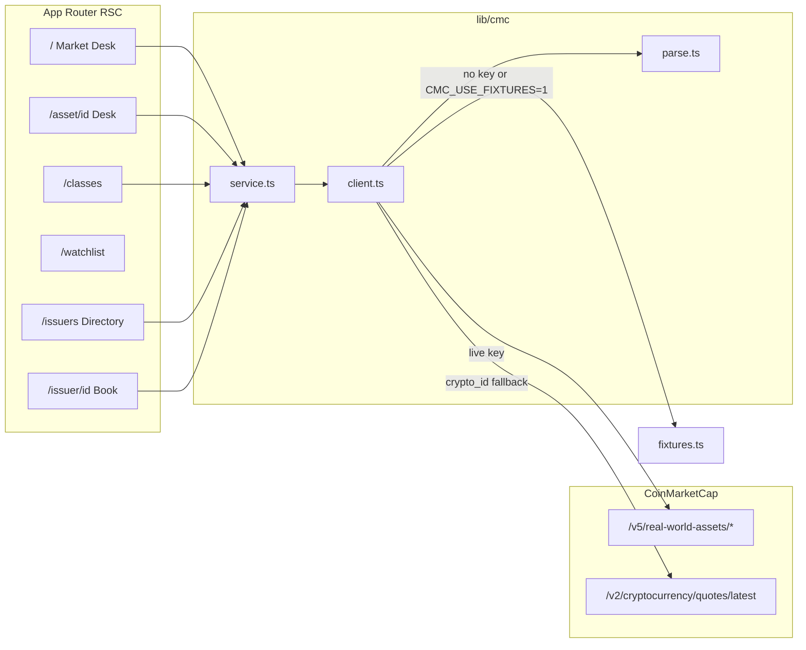
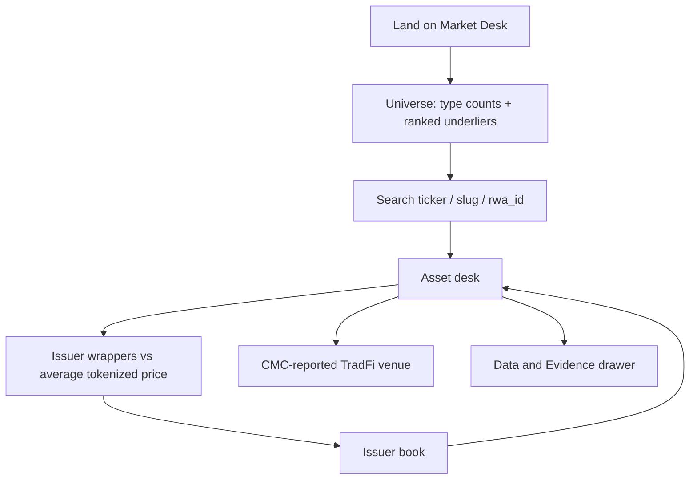

# Underlier Desk

See the real asset behind every tokenized stock, treasury, and commodity.

A research desk for the **Build with CMC: API Hackathon**, track **Real World Assets**.

**One-liner.** What real-world asset is being tokenized, who is tokenizing it, and where can you access it?

CMC already publishes two views that do not meet: ranked *underliers* and ranked *wrapper tokens*. Tickers collide — `NVDA` is a Nasdaq stock and several issuer tokens; `SPCX` is a listing and a Backpack token. Underlier Desk resolves `rwa_id`, then joins metadata, tokenized quotes, issuer tokens, and the TradFi venue CMC actually reports.

There is no splash screen. `/` is the Market Desk: universe summary plus the underlier table.

## Run locally

```bash
npm install
cp .env.example .env.local   # then paste CMC_API_KEY
npm test
npm run dev
```

Dev server: [http://127.0.0.1:43147](http://127.0.0.1:43147)

| Need | Required? |
|---|---|
| `CMC_API_KEY` from [coinmarketcap.com/api](https://coinmarketcap.com/api) | **Yes** for live data |
| Database | No |
| Auth / accounts | No |
| AI model | No |

Without a key the app still runs on checked-in fixture responses so the underlier join can be developed and tested. Force fixtures even with a key by setting `CMC_USE_FIXTURES=1`.

Never commit the key. `.env*` is gitignored; `.env.example` is not. The key is a **server-only** secret (`CMC_API_KEY`, never `NEXT_PUBLIC_*`). Evidence previews redact it if it ever appears in a payload.

## Screens

| Route | What it is |
|---|---|
| `/` | Market Desk — universe summary, lookup, type/sort, underlier table |
| `/explore` | Alias; redirects to `/` with the same query string |
| `/classes` | CMC asset-type taxonomy from `/map` |
| `/watchlist` | Browser-local saved names (no live quotes on this page) |
| `/asset/[id]` | Underlier desk: wrappers vs average tokenized price, issuers, venue |
| `/issuers` | Issuer directory |
| `/issuer/[id]` | Issuer book of tokenized underliers (no quotes on those rows) |

Query strings `q`, `type`, `sort`, `dir`, and `start` belong on `/`.

## Judge path (under two minutes)

1. Open `/` (Market Desk). Summary plus the ranked underlier table from **one** `assets/list` pull, plus cached map type counts.
2. Search `NVDA` (or `GOLD`, `SPCX`, `TLT`) on the desk.
3. Open the asset desk. Compare issuer wrappers to the average tokenized price.
4. Open an issuer book, then an underlier from that book.
5. Open **Evidence** — named CoinMarketCap endpoints and truncated envelopes from this load.

## Architecture

Pages are React Server Components. They call `lib/cmc/service.ts` on the server. The browser never fetches `/api/rwa/*`; those BFF routes exist for evidence and debugging only.





## CMC endpoints used

1. `GET /v5/real-world-assets/map`
2. `GET /v5/real-world-assets/info`
3. `GET /v5/real-world-assets/assets/list`
4. `GET /v5/real-world-assets/quotes/latest`
5. `GET /v5/real-world-assets/issuers/list`
6. `GET /v5/real-world-assets/issuers`
7. `GET /v2/cryptocurrency/quotes/latest` — fallback when an RWA token has a `crypto_id` but no price

Each page exposes **Data & Evidence** with the named endpoint and a truncated response. Sample envelopes: [`evidence/sample-cmc-map-spacex.json`](evidence/sample-cmc-map-spacex.json) and [`evidence/live-nvda-quotes.json`](evidence/live-nvda-quotes.json) (key stripped).

Debug BFF routes (same payloads the UI uses):

- `/api/rwa/screener`
- `/api/rwa/asset/[id]`
- `/api/rwa/issuers`
- `/api/rwa/issuer/[id]`

## What the API made possible / where it got in the way

The RWA family is the first time CMC lets you walk **underlier → issuer → on-chain token → venue** without scraping HTML. `rwa_id` is a separate namespace from `crypto_id`, which is exactly the collision a person hits. A live `NVDA` lookup returns multiple issuer tokens (Backed/xStock, Ondo, and others) on one quotes call.

Friction from live calls on a typical plan:

- `tradfi_markets` is venue identity (`exchange`, `ticker`, `market_url`), not a cash-market last price. The UI labels it **CMC-reported venue**.
- There is **no name-search** parameter. Lookups are ticker, slug, or `rwa_id`.
- `/issuers/list` does not include tokens; inverting “who wrapped this underlier” requires `/issuers` per issuer unless quotes already attached `issuer_id`.
- RWA list/quotes do not return `percent_change_24h`.
- `/info` About text is a long markdown FAQ, not a one-line company blurb.
- Asset-type taxonomy is uneven: stocks and ETFs dominate the map; treasuries often show up as ETFs. Do not treat map `total_size` and `assets/list` `total_size` as the same universe.
- Convert quotes arrive as a `quotes: [{ symbol: "USD", ... }]` array, not the crypto-style `quote.USD` object.
- `/market-pairs/list` is not on a typical plan. The product does not call it.

## Security and data handling

- CMC key stays on the server. It is never sent to the client, never committed, and stripped from evidence previews.
- External website and market URLs must be `https:` before they become `href` or `src`.
- Route params are allowlisted (`rwa_id` digits, issuer ids alphanumeric). Screener `sort` is allowlisted so a junk `?sort=` cannot trip a CMC error into a map fallback.
- No accounts, cookies, or user-uploaded data. Responses are `Cache-Control: no-store` on the BFF.
- Watchlist is `localStorage` only.

## Stack

Next.js App Router, TypeScript, Tailwind, shadcn/ui. Forced dark UI. CMC calls stay on the server. No database.

```bash
npm run lint
npm test
npm run build
```
